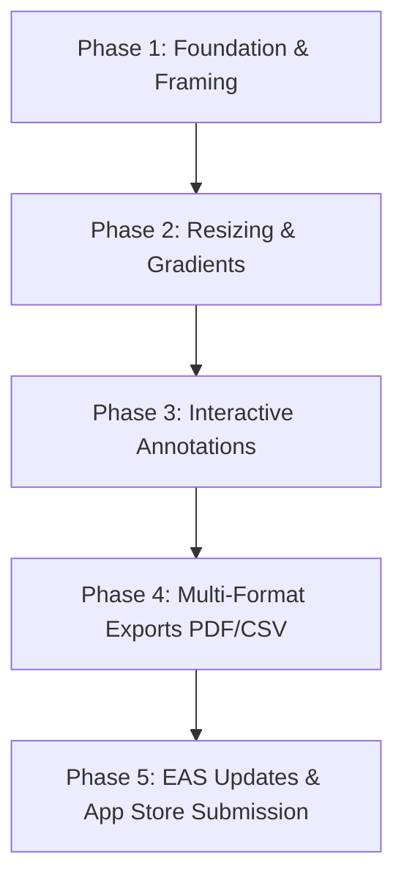

# MockupPro: Technical & Product Design Document
**The Mobile-First Screenshot Beautifier & Marketing Asset Generator for Indie Builders**

---

## 1. App Description, Benefits, and Differentiation

### 1.1 Product Overview
**MockupPro** is a lightweight, high-performance iOS utility designed for solopreneurs, indie developers, and product makers who "Build in Public." It allows users to quickly import screenshots, wrap them in modern device frames, customize backgrounds, apply professional drop shadows, annotate key changes, and export them as social-ready marketing images (PNG/JPG), spec reports (PDF), or project data (CSV) in under 15 seconds directly from their mobile device.

### 1.2 Key Benefits
* **High-converting Social Assets:** Turns simple, raw screenshots into feed-stopping images with custom gradients, 3D tilts, and shadow depths that drive higher click-through rates (CTR) on Twitter/X, LinkedIn, and Product Hunt.
* **Frictionless Workflow:** Eliminates the need to open Figma, Sketch, or browser-based tools on a laptop just to share a quick mobile/web app update.
* **Micro-Highlight Focus:** Guides viewers' attention immediately to what is new or changed using dynamic zoom bubbles, elegant hand-drawn arrows, and clear text badges.
* **Export Versatility:** Beyond standard images, developers can compile multiple screenshot mockups into a structured PDF pitch deck or export an annotated CSV change manifest for QA or client reviews.

### 1.3 Key Differences from Competitors
1. **Shareshot / Framous (Framing Utilities):** These apps only put a bezel around an image. MockupPro is a *content editor*, supporting advanced micro-annotations (magnifying lenses, minimalist text overlays, code-font banners).
2. **AppScreens / Launch Shots (App Store Template Generators):** These are desktop-first tools optimized for creating rigid 10-card App Store listing sets. MockupPro is optimized for dynamic, single-image social posts (16:9 landscape, square, portrait feeds).
3. **Figma / Canva (General Editing):** Highly manual and tedious on mobile. MockupPro features automatic canvas resizing, snap-to-bezel boundaries, and layout templates tailored specifically for app screenshots.

---

## 2. Technical Design

### 2.1 State Management Architecture
The app's editor state holds canvas layout properties, design tokens, and an array of user-created annotation objects. Using a state manager like **Zustand** allows for light, fast updates during dragging animations:

```typescript
interface CanvasState {
  imageUri: string | null;
  aspectRatio: '16:9' | '1:1' | '4:5' | 'AppStore';
  backgroundColor: string; // Gradient key or solid color
  frameType: 'iPhone16Pro' | 'MacbookPro' | 'SafariBrowser' | 'None';
  padding: number; // Percentage padding around the frame
  shadowIntensity: number; // 0 to 1
  rotation3D: number; // Tilting degrees
  annotations: AnnotationElement[];
  addAnnotation: (elem: AnnotationElement) => void;
  updateAnnotation: (id: string, updates: Partial<AnnotationElement>) => void;
}

interface AnnotationElement {
  id: string;
  type: 'Text' | 'Arrow' | 'Spotlight';
  x: number; // Percent-based X coordinate on canvas (for responsiveness)
  y: number; // Percent-based Y coordinate
  scale: number;
  text?: string;
  arrowDirection?: number; // angle in degrees
  zoomFactor?: number; // for Spotlight magnifier
}
```

### 2.2 View Hierarchy & Render Pipeline
To compile the final high-resolution asset without using complex low-level graphics engines, MockupPro renders a hidden off-screen or scaled-down viewport using React Native components, which is then captured via a raster native component:

```
[ Canvas Container (View with Gradient Backdrop) ]
  └── [ Canvas Safe Area (View scaled to match active Aspect Ratio) ]
        ├── [ 3D/Transform Wrapper (Reanimated View with skew/shadow) ]
        │     └── [ Bezel/Device Frame (Absolute Image Overlay) ]
        │           └── [ Screenshot Image (Rounded corners, nested under frame) ]
        │
        └── [ Annotation Wrapper (Absolute View matching Canvas dimensions) ]
              ├── [ Drag-and-Drop Arrows (SVG paths rendered over elements) ]
              ├── [ Text Cards (Draggable Text component with custom fonts) ]
              └── [ Spotlight Magnifier (Circular canvas reading cropped slice of image) ]
```

### 2.3 Image & Document Generation Pipeline
* **PNG/JPG Export:** A React `ref` is attached to the *Canvas Safe Area* container. The `react-native-view-shot` library parses the native view hierarchy, resolves styles (shadows, gradients, transformations), and writes a flat high-resolution PNG file to the cache.
* **PDF Spec Deck Export:** Generates an HTML document combining base64 data of all exported PNG screenshots alongside structured text/changelog descriptions. The HTML is fed into `expo-print` to output a print-ready, vectorized PDF file.
* **CSV Spec Export:** Converts the project's metadata, text changes, annotations coordinates, and timestamps into a standard comma-separated text string, writing it as a `.csv` file via `expo-file-system`.

### 2.4 OTA Delivery Architecture (EAS Update)
To instantly distribute new device bezels (e.g. when Apple releases new iPhones), background gradient assets, or layout fixes without waiting for App Store approval:
1. `expo-updates` checks for updates in the background on startup.
2. Device frames and assets are stored as standard remote JSON configurations inside the React Native bundle or downloaded dynamically to `FileSystem.documentDirectory` upon loading the update.
3. Critical UI fixes are hot-patched via EAS OTA channels (`production` or `staging`).

---

## 3. Key Libraries to Use

### 3.1 Core Canvas, UI, and Animations
* **`react-native-view-shot`**: Essential for capturing the layered canvas container and saving it as a high-quality PNG.
* **`react-native-gesture-handler`**: Provides high-performance tap, pan, and pinch gesture callbacks for scaling and moving text boxes, arrows, and magnifying lenses.
* **`react-native-reanimated`**: Drives the 60fps physics of UI overlays, canvas rotations, 3D tilts, and panel drag-downs.
* **`react-native-svg`**: Used to draw customized vector shapes like arrows, highlight rectangles, and spotlight guidelines.

### 3.2 File Generation & Document Exports
* **`expo-print`**: Takes an HTML template string populated with the screenshots and metadata and converts it into a multi-page PDF document.
* **`expo-file-system`**: Creates local temporary paths and outputs the CSV/text manifests into sharable physical file streams.
* **`expo-sharing`**: Displays the system share sheet, enabling users to copy mockups to the clipboard, email PDFs, or save CSV manifests to iCloud Drive.
* **`expo-media-library`**: Saves the generated screenshot directly to the user's Camera Roll.

### 3.3 EAS Infrastructure & Background Updates
* **`expo-updates`**: Configures the app to check for, download, and apply OTA JS updates immediately upon launch or app restart.

### 3.4 State, Storage, and Billing
* **`zustand`**: Lightweight state management, maintaining editing history, template choices, and canvas offsets.
* **`react-native-purchases` (RevenueCat)**: Integrates Apple StoreKit for paid subscriptions (pro templates, custom device frames, watermark removal).

### 3.5 Apple iOS Native SDK Frameworks (Foundation & Core Kits)
For advanced features, performance optimization, and deep iOS platform integration, MockupPro will leverage the following native CocoaTouch/Swift frameworks. These can be integrated via Expo native wrappers or custom Swift Native Modules:
* **CoreGraphics & CoreImage:** Used for hardware-accelerated bitmap transformations, drop shadow renderings, blurring background canvas items, and scaling imported screenshot assets.
* **Photos & PhotosUI (`PHPhotoLibrary`):** Provides privacy-compliant native photo picker sheets (`PHPickerViewController`) and handles direct filesystem writing to iOS Photo Albums with appropriate permission prompts (`NSPhotoLibraryAddUsageDescription`).
* **PDFKit (`PDFView` & `PDFDocument`):** Enables native, vectorized PDF deck compilation and high-performance in-app previews of generated pitch reports without launching external browsers.
* **LinkPresentation (`LPLinkMetadata`):** Populates rich card previews (thumbnails and titles) for shared mockups in the native iOS Share Sheet, so that sharing to social media apps presents a formatted graphical link.
* **StoreKit (`SKStoreReviewController` & StoreKit 2):** Handles native in-app subscriptions, receipts validation, and launches prompt overlays requesting App Store ratings from builders.
* **UniformTypeIdentifiers (`UTType`):** Ensures correct system-wide file type associations when registering and sharing PNG, PDF, and CSV document configurations.
* **ActivityKit & WidgetKit:** Native Swift frameworks to configure Lock Screen widgets, Home Screen widgets, and Live Activities / Dynamic Island status indicators for active layout exports.

### 3.6 Live Activities & iOS Widget Extensions (Expo Integration)
To implement iOS widgets and Live Activities in an Expo/React Native ecosystem, custom native targets must be configured. We will use the following bridge libraries and configuration tools:
* **`expo-target-extension` or `@flish/expo-widget-extension`:** Config plugins that automate the creation of Xcode extension targets (`WidgetExtension` and `LiveActivityExtension`) during `npx expo prebuild`. This allows writing native SwiftUI widgets directly inside the `/ios` project directories without manual configuration files getting wiped on EAS builds.
* **`react-native-shared-group-preferences`:** Allows the JavaScript app to save data (such as builder streak counters, recent mockup counts, or project preview paths) to a shared iOS App Group container (`group.com.yourdomain.mockuppro`). The Swift widget code reads this data via `UserDefaults(suiteName: "group.com.yourdomain.mockuppro")` to render updates.
* **`react-native-live-activity`:** Wraps iOS `ActivityKit` APIs to start, update (sending render progress metrics), and end Live Activities on the Lock Screen and Dynamic Island directly from the TypeScript layer.

### 3.7 Additional Native Platform Utilities
For premium polish and hardware-level operations, the following native utility libraries will be used:
* **`expo-haptics`:** Invokes iOS `UIImpactFeedbackGenerator` and `UINotificationFeedbackGenerator` for physical haptic feedback when aligning overlays, snapping device cards to grid markers, or completing exports.
* **`react-native-mmkv`:** High-performance, native C++ storage engine replacing AsyncStorage. Essential for loading project history lists and saving large JSON editor states instantaneously on startup with zero main-thread lag.
* **`expo-font`:** Core Graphics / Core Text registration wrapper that loads custom developer typography (`ttf` / `otf` files) dynamically during editing sessions.
* **`react-native-device-info`:** Fetches specific iOS hardware models, notch heights, and safe area metrics to auto-calculate layouts for different screenshot templates.
* **`expo-tracking-transparency`:** Controls the native iOS App Tracking Transparency (ATT) alert, ensuring App Store compliant tracking behavior for onboarding analytics.
* **`expo-apple-authentication`:** High-conversion Apple ID login provider to sync custom mock-up settings and design assets between iPhone and iPad devices using Apple Keychain services.

---

## 4. Step-by-Step MVP Build Strategy



### Phase 1: Foundation & Framing (Week 1)
* **Goal:** Import an image, wrap it in a mock device border, and save it.
* **Tasks:**
  * Build the import handler using `expo-image-picker`.
  * Create a basic layout view structure representing a phone bezel wrapping the user's screenshot.
  * Implement `react-native-view-shot` to capture the frame.
  * Connect `expo-media-library` to save the output.

### Phase 2: Resizing & Gradients (Week 2)
* **Goal:** Make the background premium and allow custom aspect ratios.
* **Tasks:**
  * Add canvas ratio selectors (16:9 for Twitter/X, 4:5 for LinkedIn, 1:1 for Instagram).
  * Build a library of 10 modern gradient meshes.
  * Implement padding and rounded-corner adjustments for the screenshot card.
  * Add a 3D rotation transform slider to skew the card for a dynamic look.

### Phase 3: Interactive Annotations (Week 3)
* **Goal:** Allow users to call out changes and add custom text.
* **Tasks:**
  * Implement dynamic text overlay box with custom developer fonts.
  * Create the "Spotlight Zoom" tool: A draggable circular view that magnifies whatever is directly underneath it.
  * Add a draggable vector arrow tool using `react-native-svg` and `react-native-gesture-handler`.

### Phase 4: Multi-Format Exports (Week 4)
* **Goal:** Enable professional handoffs with PDF and CSV formats.
* **Tasks:**
  * Create an HTML template containing layout dimensions, notes, and the base64 screenshot.
  * Pass the template to `expo-print` to compile a professional PDF document.
  * Write a simple CSV string generator recording image file links, timestamp, and annotation logs (e.g. `Type, Text, X, Y`).
  * Integrate `expo-sharing` to export the PDF/CSV files.

### Phase 5: EAS Updates & Store Submission (Week 5)
* **Goal:** Setup OTA capabilities and prepare for App Store launch.
* **Tasks:**
  * Install and configure `expo-updates` in `app.json`.
  * Set up EAS Build and OTA release channels.
  * Add RevenueCat subscription logic ($4.99/mo premium paywall).
  * Write App Store description metadata and submit Build #1 to TestFlight.

---

## 5. UX Wireframes (ASCII Layouts)

### Screen A: Welcome Dashboard / History Log
```
+--------------------------------------------+
|  [Logo] MockupPro            [Subscription] |
+--------------------------------------------+
|                                            |
|   +------------------------------------+   |
|   |                                    |   |
|   |         [+] IMPORT SCREENSHOT      |   |
|   |     (Tap to choose from Gallery)   |   |
|   |                                    |   |
|   +------------------------------------+   |
|                                            |
|   RECENT PROJECTS                          |
|   +------------------+  +------------------+|
|   | [Mockup Image]   |  | [Mockup Image]   ||
|   | Update_June24.png|  | ProductHunt.png  ||
|   +------------------+  +------------------+|
|                                            |
|   TEMPLATES PRESETS                        |
|   [ X Landscape ]  [ LinkedIn ]  [ Square ]|
|                                            |
+--------------------------------------------+
| [Dashboard]        [Settings]        [Help] |
+--------------------------------------------+
```

### Screen B: Main Canvas Editor (Device Framing & Background)
```
+--------------------------------------------+
| [Cancel]              [Canvas]         [Export] |
+--------------------------------------------+
|                                            |
|  +--------------------------------------+  |
|  |   Gradient Background Grid           |  |
|  |                                      |  |
|  |       +--------------------+         |  |
|  |       | [iPhone Bezel Frame|         |  |
|  |       |  +--------------+  |         |  |
|  |       |  | Screenshot   |  |         |  |
|  |       |  | Content      |  |         |  |
|  |       |  +--------------+  |         |  |
|  |       +--------------------+         |  |
|  |                                      |  |
|  +--------------------------------------+  |
|                                            |
|  TOOLBAR OPTIONS:                          |
|  [Ratio]  [Frame]  [Gradient]  [Annotate]  |
|                                            |
|  SUB-SELECTOR (Gradients):                 |
|  (( #ff007f ))  (( #8e2de2 ))  (( #f7b733 ))|
|                                            |
|  PADDING SLIDER:                           |
|  Min [==========o-----------------] Max    |
|                                            |
+--------------------------------------------+
```

### Screen C: Annotation Toolbar & Overlays (Interactive Layer)
```
+--------------------------------------------+
| [Done]              [Annotate]      [Delete] |
+--------------------------------------------+
|                                            |
|  +--------------------------------------+  |
|  |                                      |  |
|  |       +--------------------+         |  |
|  |       |  +--------------+  |         |  |
|  |       |  | Screenshot   |  |         |  |
|  |       |  | [Spotlight]  |  |         |  |
|  |       |  |    (Zoom)----|----------+ |  |
|  |       |  +--------------+  |       | |  |
|  |       +--------------------+       | |  |
|  |                                    v |  |
|  |                             (Zoom Bubble)|
|  +--------------------------------------+  |
|                                            |
|  SELECT ANNOTATION:                        |
|  [ Text Box ]   [ Spotlight ]   [ Arrow ]  |
|                                            |
|  PROPERTIES (Arrow):                       |
|  Color: [White] [Neon Green] [Red]         |
|  Thickness:  - [===o------] +              |
|                                            |
+--------------------------------------------+
```

### Screen D: Export Panel & File Delivery Configuration
```
+--------------------------------------------+
| [Back]               [Export]               |
+--------------------------------------------+
|                                            |
|   PREVIEW CAPTURE                          |
|   +------------------------------------+   |
|   |           Beautified Mockup        |   |
|   +------------------------------------+   |
|                                            |
|   EXPORT FORMAT                            |
|   (x) PNG (High-Res Image for Social)      |
|   ( ) PDF Spec Sheet (Client Pitch Deck)   |
|   ( ) CSV Metadata (Spec Manifest Table)   |
|                                            |
|   OPTIONS:                                 |
|   [ ] Remove Watermark (Premium)           |
|   [ ] Compress Image (Optimize for web)    |
|                                            |
|   +------------------------------------+   |
|   |         SHARE / SAVE NOW           |   |
|   |     (Opens Native Share Sheet)     |   |
|   +------------------------------------+   |
|                                            |
+--------------------------------------------+
```

---

## 6. Monetization & Subscription Model

MockupPro will employ a **Freemium + Tiered Subscription** model designed to monetize power builders while allowing casual builders to preview core functionality.

### 6.1 Pricing Plan Structures
1. **Free Tier ($0/month)**
   * **Included:** 3 exports per day, basic iPhone 16 Pro flat frame, 3 standard gradient backgrounds, and standard system fonts.
   * **Limitation:** All exports include a subtle `made with MockupPro` watermark in the bottom corner.
2. **Pro Monthly ($4.99/month)**
   * **Included:** Unlimited high-res PNG/JPG exports, access to all premium device frames (MacBook Pro, Safari, iPad, dual device grids), unlimited gradient meshes, advanced annotations (Spotlight Zoom, vector arrows), and custom font files (.otf/.ttf).
   * **Bonus:** Removes the watermark and unlocks PDF/CSV spec sheet exports.
3. **Pro Annual ($29.99/year)**
   * Same entitlements as the Monthly tier at a **50% savings** ($2.50/mo equivalent). Ideal for committed indie builders.
4. **Indie Lifetime ($59.99 one-time purchase)**
   * Same entitlements as Pro. Serves as a high-value anchor to increase annual subscription conversion, while catering to the developer segment that prefers avoiding monthly subscriptions.

### 6.2 Paywall Entitlements & Triggers
To drive conversion, the app will trigger paywall prompts at key friction points:
* **The Watermark Toggle:** When the user attempts to toggle off the "Show Watermark" switch in the Export Panel (Screen D).
* **Premium Frame Select:** When a user taps a locked device frame (e.g., tilted 3D iPhone or MacBook) in the frame selector menu.
* **Document Export Trigger:** Tapping "PDF Spec Sheet" or "CSV Metadata" export types in the Export Panel.
* **Asset Upload:** Tapping "Upload Custom Font" or adding a custom logo watermark.

### 6.3 Technical Billing Integration
* **StoreKit 2 / RevenueCat:** Using `react-native-purchases` to define entitlements. Entitlements are validated asynchronously on launch.
* **Restore Purchases:** Place a clear "Restore Purchases" button on the Paywall view to comply with Apple Guideline 3.1.1.
* **Subscription Management:** Link users directly to the Apple Subscriptions settings page (`itms-apps://apps.apple.com/account/subscriptions`) within the settings screen.

---

## 7. App Naming, Identity & ASO (App Store Optimization)

Based on App Store research, exact names like *"Mockup Studio"* and *"Mockup Frame"* are already registered. To ensure organic search traffic without risking trademark rejections (Apple Guideline 2.3.7), we will use one of these two verified **free/unregistered** name combinations:

### 7.1 Recommended Name Candidates
1. **MockupBuilder** *(Recommended for developer focus & SEO)*
   * **Why it works:** Direct, high-intent brand. It targets developers (indie "builders") and directly contains the core keyword **"Mockup"**. It positions the app as an active creation tool, justifying the monthly subscription.
   * **Search Keywords:** "mockup maker", "app screenshot generator", "device frames".
2. **MockupDeck** *(Recommended for document/presentation focus)*
   * **Why it works:** Focuses on the unique value proposition of compiling multiple screenshots into a single vectorized PDF pitch presentation or spec sheet deck.
3. **MockupWrapper** *(Recommended for utility/action focus)*
   * **Why it works:** Direct reference to the core developer action of wrapping screenshots in device bezels.

### 7.2 App Store Metadata Strategy (MockupBuilder)
* **App Title (30 Char limit):** `MockupBuilder — Device Frames`
* **App Subtitle (30 Char limit):** `App Screenshot Mockup Maker`
* **Core Search Tag keywords:** `screenshot maker, app preview, figma wrapper, before after slider, code shot designer, device bezel editor, clean mockups`

---

## 8. Innovative Solutions & Features

Unlike generic framing tools, MockupPro solves developer-specific workflow problems with these unique features:

### 8.1 Before / After Split Slider
* **The Problem:** Developers want to show how a UI layout or performance metric improved, but placing two images side-by-side on mobile takes up too much screen width.
* **The Solution:** A template where users upload two screenshots. The editor displays them in a split frame with a customizable divider line and "Before" / "After" labels, simulating an interactive slider in a static export.

### 8.3 Live Tweet / Feed Simulator
* **The Problem:** Builders don't know if their mockup text is legible or if key elements will be cut off by Twitter/LinkedIn feed cropping.
* **The Solution:** A toggle button in the preview panel that renders the compiled mockup card inside a simulated iOS Twitter/LinkedIn post preview container. Builders see exactly what their post looks like in a user's feed before saving it.

### 8.3 Dynamic Contrast Mode
* **The Problem:** Importing a dark-mode screenshot into a dark gradient makes the device disappear.
* **The Solution:** The app automatically parses the average color value of the screenshot edges. If dark mode is detected, it auto-applies a subtle neon edge glow to the device border and lightens the background gradient to guarantee contrast.

### 8.4 Code Block Terminals
* **The Problem:** Developers often want to share a screenshot along with the exact code snippet that built it.
* **The Solution:** An overlay template that renders a stylized, syntax-highlighted code block card alongside the screenshot mockup card inside a single canvas template, complete with Mac window buttons.

---

## 9. MVP Acceptance Criteria Checklist

Before launching Build #1 to the App Store, the application must pass the following validation targets:

### 9.1 Performance & Native Rendering
- `[ ]` **Render Speed:** Canvas to PNG capture via `react-native-view-shot` must take less than 3.0 seconds on iPhone 12 or newer.
- `[ ]` **Frame Precision:** The screenshot must fit perfectly behind the bezel template overlay with zero edge leakage, white space, or overlap misalignment on high-density displays (3x retina).
- `[ ]` **Dynamic Sizing:** Resizing canvas aspect ratios from 16:9 to 1:1 or 4:5 must automatically scale the child device mockups to remain fully visible within the safe area padding.

### 9.2 File Handoff & Document Generation
- `[ ]` **PDF Compilation:** Exporting a multi-image project deck must render a clean, vectorized, multi-page PDF document without cut-off margins or broken image blocks.
- `[ ]` **CSV Validation:** The CSV file must correctly parse the target elements list into a clean, comma-separated format that parses correctly in Microsoft Excel and Google Sheets.
- `[ ]` **Clipboard Action:** The copy-to-clipboard action must copy the physical PNG binary file, allowing immediate pasting into external messaging apps (Twitter/X, Slack, Messages).

### 9.3 iOS Guidelines & Platform Conformity
- `[ ]` **Guideline 3.1.1 (Subscriptions):** The paywall must contain clear Terms of Use, Privacy Policy links, clear price listing per tier, and a functional "Restore Purchases" button.
- `[ ]` **Guideline 5.1.1 (Privacy):** Permission request alerts for `NSPhotoLibraryAddUsageDescription` must be triggered only when the user clicks "Save to Camera Roll".
- `[ ]` **Offline Capabilities:** The MMKV cache must allow the app to boot, view project history, and edit existing layouts fully offline (subscribing checks should gracefully fall back to cached RevenueCat entitlements).


